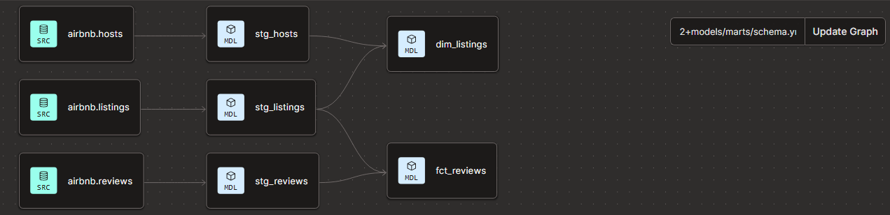
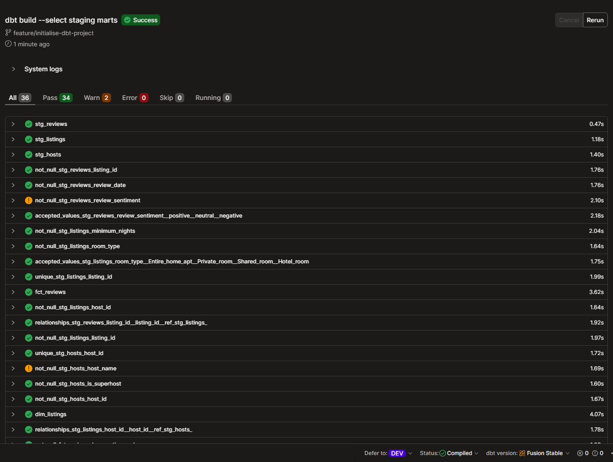

# Airbnb Analytics Pipeline

End-to-end data engineering project demonstrating a production-style modern data stack: 
**Snowflake → dbt → analytics-ready marts**, with comprehensive data quality testing, 
deduplication logic, and dimensional modelling.

---

## Architecture

Layered medallion architecture following Kimball dimensional modelling principles:

- **Raw layer** (`AIRBNB.RAW`) — Source data loaded from public S3 via Snowflake `COPY INTO`
- **Staging layer** (`models/staging/`) — Cleaned, deduplicated, type-cast data; one model per source
- **Marts layer** (`models/marts/`) — Business-ready dimensional and fact tables for analytics

### Pipeline lineage

The full DAG showing dependencies from sources through staging to marts:



---

## Tech stack

| Layer | Tool |
|---|---|
| Data warehouse | Snowflake (Standard, AWS EU-West-2) |
| Transformation | dbt Cloud (running dbt Fusion 2.0) |
| Authentication | RSA key-pair (service account with role-based access control) |
| Storage format | Snowflake native + public S3 sources |
| Version control | Git + GitHub, conventional commits, feature branching |
| Package management | dbt-utils for surrogate key generation |

---

## Data quality testing

This project treats data quality as a first-class concern. **36 tests across both layers**, 
including:

- **Primary key uniqueness** on all `*_id` columns
- **Not-null assertions** with severity-tuned warnings for known acceptable noise
- **Referential integrity** via dbt `relationships` tests (foreign key validation)
- **Categorical value constraints** via `accepted_values` tests
- **Business rule validation** in the marts layer (e.g. price tiers, stay length categories)

### Test results



Result: **34 passing, 2 intentional warnings, 0 errors**. The two warnings document real 
source-data noise (0.1% null rate on `host_name` and `review_sentiment`) — configured to 
surface but not block the pipeline.

---

## Models

### Staging layer

| Model | Purpose |
|---|---|
| `stg_listings` | Cleans listings; converts price string `'$50.00'` to numeric, renames columns |
| `stg_reviews` | Cleans reviews; uses `ROW_NUMBER()` to deduplicate identical source rows |
| `stg_hosts` | Cleans hosts; converts `'t'`/`'f'` strings to native booleans |

### Marts layer

| Model | Type | Purpose |
|---|---|---|
| `dim_listings` | Dimension | Denormalised listing attributes with host data and business categorisations (price tier, stay length category) |
| `fct_reviews` | Fact | Review events at review grain with surrogate keys, derived time attributes, and listing context |

---

## Engineering highlights

A few decisions that demonstrate senior-level data engineering thinking:

**Role-based access control** — A dedicated `DBT_ROLE` and `DBT_USER` with least-privilege 
grants. The dbt service account authenticates via RSA key pair, not password — the modern 
production standard.

**Surrogate key design** — The `fct_reviews.review_id` is a hash of 
`(listing_id, review_date, reviewer_name, review_text)`. The composition was determined 
empirically after the uniqueness test surfaced cases of different reviewers sharing first 
names and reviewing on the same date. Source-level deduplication handles the remaining 
true source duplicates.

**Idempotent SQL** — All table creation uses `IF NOT EXISTS` so the setup script is safe 
to re-run.

**Future grants** — Snowflake permissions use `GRANT ... ON FUTURE TABLES` so newly-created 
objects automatically inherit the correct permissions, avoiding the common 
"works in dev, broken in prod" pattern.

**Conventional commits** — Every commit follows the format `feat:`, `chore:`, `test:` etc. 
for readable history and CI/CD integration.

---

## Project structure

airbnb-analytics-dbt/
├── dbt_project.yml          # Project config
├── packages.yml             # dbt_utils dependency
├── models/
│   ├── staging/             # One model per source, cleaning only
│   │   ├── sources.yml      # Declared raw sources
│   │   ├── schema.yml       # Tests + documentation
│   │   ├── stg_listings.sql
│   │   ├── stg_reviews.sql
│   │   └── stg_hosts.sql
│   └── marts/               # Business-ready models
│       ├── schema.yml       # Tests + documentation
│       ├── dim_listings.sql
│       └── fct_reviews.sql
└── README.md

---

## Running the project

Prerequisites: dbt Cloud account, Snowflake account with the AIRBNB database populated.

```bash
# Install dbt packages
dbt deps

# Build the entire pipeline (runs and tests in DAG order)
dbt build --select staging marts

# Run individual layers
dbt run --select staging
dbt run --select marts

# Run tests independently
dbt test --select staging
dbt test --select marts
```

---

## About this project

Built as a portfolio project to demonstrate end-to-end modern data engineering practice — 
from cloud warehouse setup with proper security, through dimensional modelling, to 
comprehensive data quality testing. Code is production-style: idempotent, version 
controlled, tested, and documented.